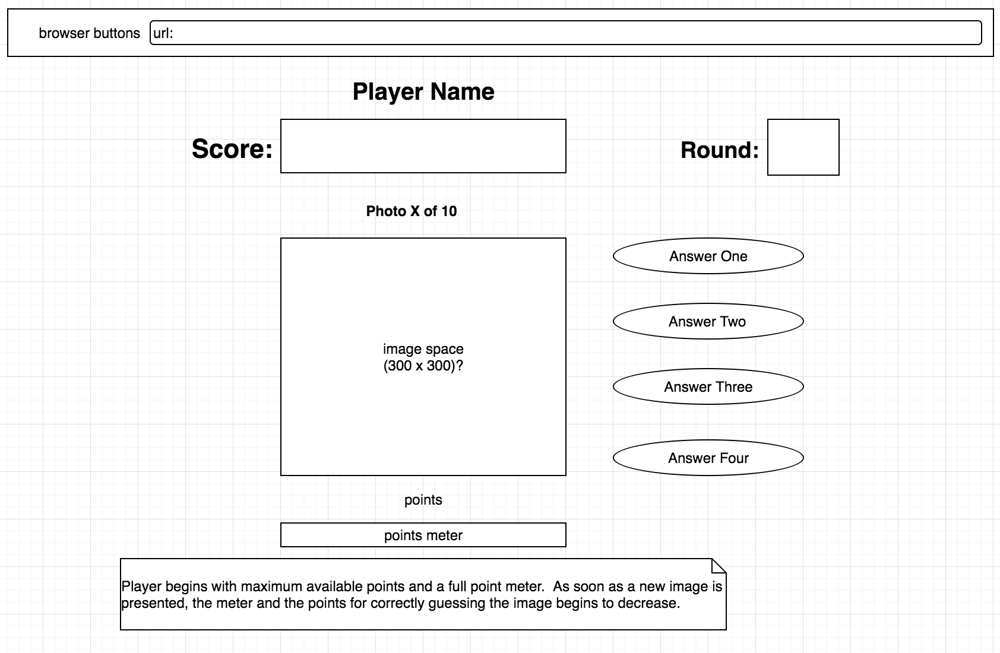

# tlippincott.github.io

__User Stories__

1. User clicks on the rotating logo to begin the game.

2. User reads the instructions for the game.

3. User enters their name and clicks the OK button or presses the enter key.

4. As the artist's picture fade into view, and as their music plays, the user attempts to guess the artist by clicking on the four buttons displaying various artist names.

5. At the end of each round, the user clicks the OK button or presses the enter key to begin the next round.

6. At the end of the game, the user's total score is displayed.

Wireframe

Technologies Used

I utilized HTML, CSS, and JQuery.

Possible Enhancements

I would like to enhance the game by checking the size of the image before loading to ensure it is not a very small image which will be hard for the end user to view. I would also like to add some mini-game between rounds where the user can bet their current points and play the mini-game (e.g. 21, three-card-monte, etc.).
